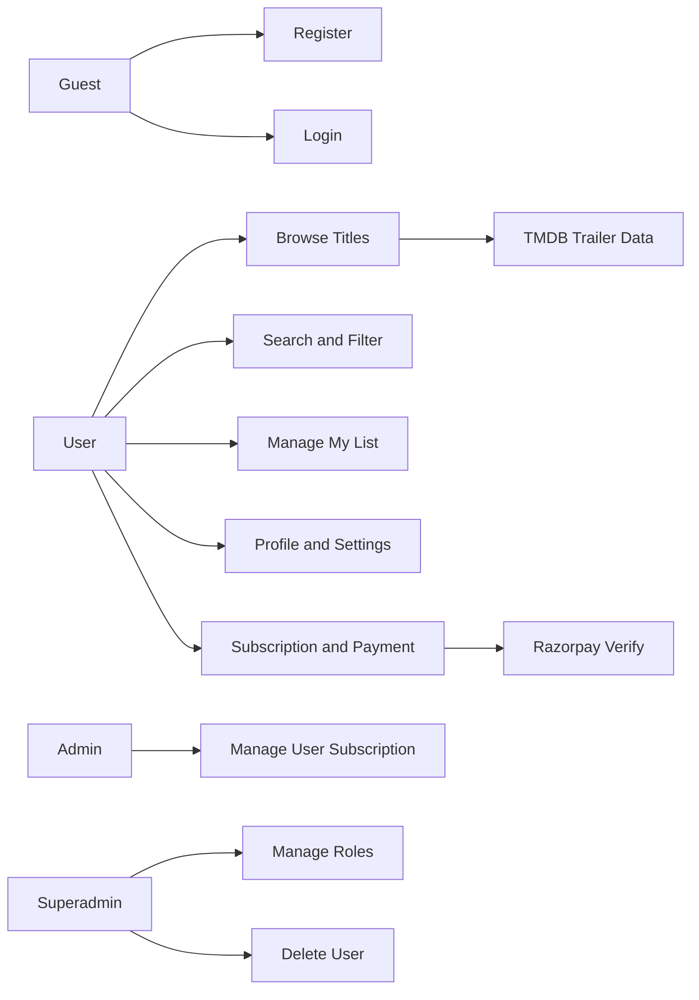
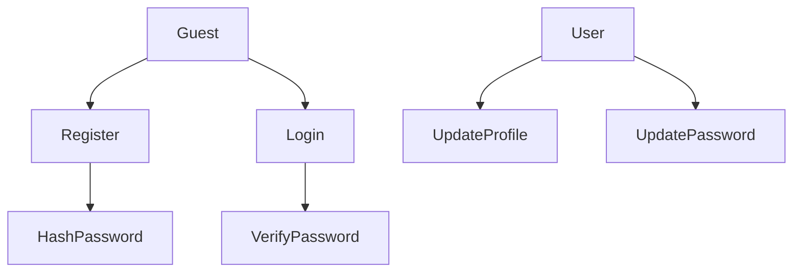
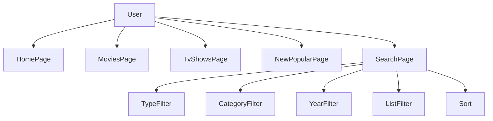
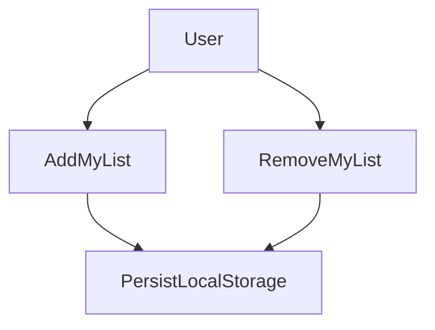
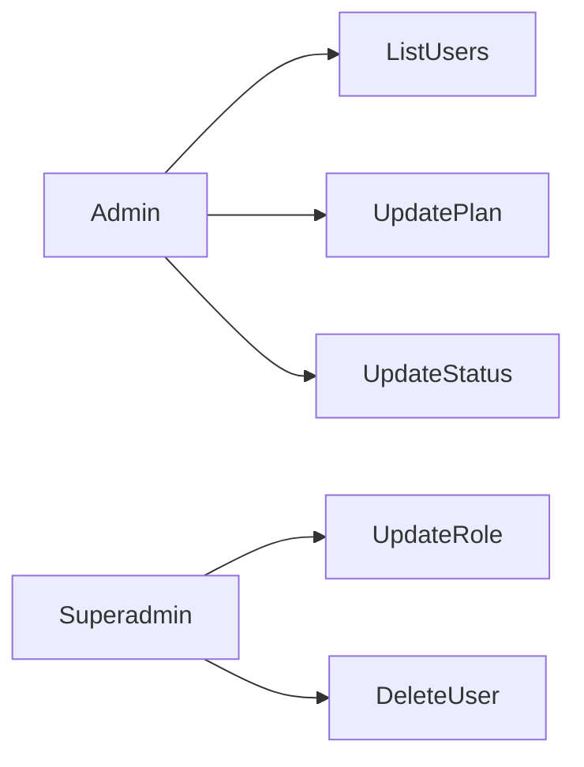
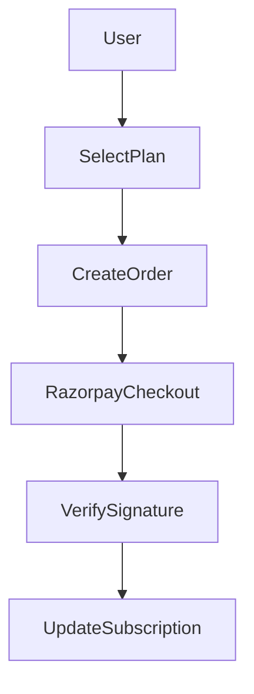
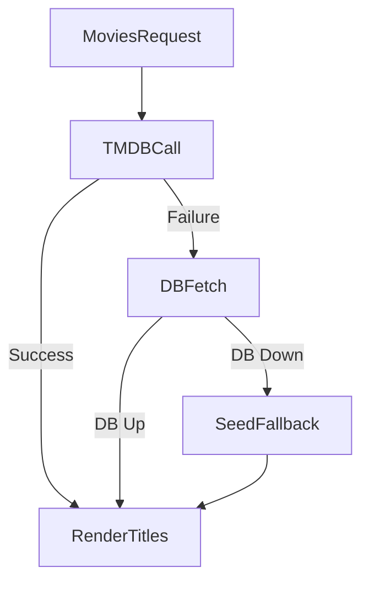
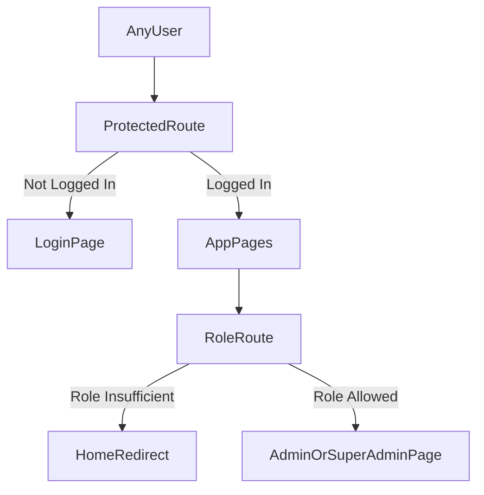

# INDEX

| S.No | Chapters | Page No |
|---|---|---|
| 1 | Introduction | 2 |
| 2 | Objectives | 2-3 |
| 3 | Analysis | 3-5 |
| 4 | Project Modules | 5-6 |
| 5 | Use Case Diagram | 7-9 |
| 6 | Implementation | 9-26 |
| 7 | Conclusion | 27 |
| 8 | Future Enhancement | 27 |
| 9 | References | 27-28 |

---

# 1. Introduction

This Netflix Clone project is a full-stack OTT platform simulation built using React, Node.js, Express, and MongoDB.  
The system replicates key Netflix-like workflows:

1. User authentication and profile management
2. Movie and TV show browsing
3. Search, filtering, sorting, and trailer preview
4. Personalized list handling (My List)
5. Settings and subscription management
6. Admin and superadmin dashboard controls
7. Payment-based subscription upgrade using Razorpay verification

The project is designed with modular architecture and role-based behavior so that each feature can be extended independently.

---

# 2. Objectives

## 2.1 Primary Objectives

1. Develop an OTT-style responsive web application.
2. Build secure user registration and login with hashed passwords.
3. Enable rich catalog discovery through routes, categories, and search.
4. Implement role-aware access control (user/admin/superadmin).
5. Provide subscription flows with payment verification.

## 2.2 Secondary Objectives

1. Ensure UI consistency and maintainability.
2. Handle API/database failures gracefully with fallbacks.
3. Keep code structured through separated controllers, routes, models, and API clients.

---

# 3. Analysis

## 3.1 Problem Statement

Most clone projects focus only on frontend visuals and ignore realistic backend behavior.  
This project solves that by combining:

1. Real API-based authentication and user management
2. Dynamic movie data sources
3. Role-protected administration
4. Payment verification workflow

## 3.2 Existing System vs Proposed System

### Existing Basic Clone

1. Static movie cards
2. No user roles
3. No real subscriptions/payments
4. Limited backend validation

### Proposed System

1. Dynamic API-driven movie catalog
2. Multi-role access (user/admin/superadmin)
3. Subscription and Razorpay verification
4. Search/filter/sort and trailer integration
5. Modular, extensible architecture

## 3.3 Feasibility

1. Technical feasibility: High (MERN stack compatibility)
2. Operational feasibility: High (clear module boundaries)
3. Economic feasibility: Good (open-source tools)
4. Schedule feasibility: Good (incremental implementation)

---

# 4. Project Modules

## 4.1 Frontend Module (`frontend/src`)

1. Route-based pages (`App.js`)
2. API service integration (`api/*.js`)
3. Reusable UI components (`components/*.js`)
4. Local state and storage persistence

## 4.2 Backend Module (`backend/src`)

1. Express app bootstrap (`app.js`, `server.js`)
2. Controllers (`controllers/*.js`)
3. Routes (`routes/*.js`)
4. Models (`models/*.js`)

## 4.3 Authentication Module

1. Register/login endpoints
2. Password hashing/verification (`bcryptjs`)
3. Profile/password update endpoints

## 4.4 Content Module

1. Movies endpoint with filter support
2. TMDB trailer fetching
3. Fallback to DB/seed data if TMDB unavailable

## 4.5 Admin Module

1. User listing/search
2. Subscription update by admin
3. Role update and delete by superadmin

## 4.6 Payment Module

1. Razorpay order creation
2. Signature verification (HMAC SHA-256)
3. Subscription update post-verification

---

# 5. Use Case Diagram (Extended)

This section contains multiple use-case diagrams as requested.

## 5.1 Use Case Diagram 1: Overall System



## 5.2 Use Case Diagram 2: Authentication



## 5.3 Use Case Diagram 3: Content Discovery



## 5.4 Use Case Diagram 4: My List Management



## 5.5 Use Case Diagram 5: Admin Operations



## 5.6 Use Case Diagram 6: Payment Flow



## 5.7 Use Case Diagram 7: Error/Fallback Flow



## 5.8 Use Case Diagram 8: Role-Based Route Access



## 5.9 Use Case Table

| Actor | Use Cases |
|---|---|
| Guest | Register, Login |
| User | Browse, Search, Play Trailer, My List, Profile, Subscription |
| Admin | List users, update subscription plan/status |
| Superadmin | All admin cases + role update + delete user |
| TMDB | Supplies dynamic content/trailer data |
| Razorpay | Payment order + signature verification |

---

# 6. Implementation

## 6.1 Technology Stack

1. Frontend: React, React Router, Axios, CSS
2. Backend: Node.js, Express, Mongoose, bcryptjs
3. Integrations: TMDB API, Razorpay

## 6.2 Frontend Implementation Summary

1. Root app handles routes and shared state.
2. Protected pages use `ProtectedRoute`.
3. Admin pages use role checks via `RoleRoute`.
4. Search page performs local filtering, sorting, and list checks.
5. Footer includes policy links and social section.

## 6.3 Backend Implementation Summary

1. `/api/auth/*` handles register/login/profile/password.
2. `/api/movies/*` handles content fetch and trailer retrieval.
3. `/api/admin/*` handles privileged user operations.
4. `/api/payments/*` handles order creation and verification.

## 6.4 Data Models

### User Model

1. Name, email, passwordHash
2. Avatar and role
3. Subscription object (plan/status/services/renewalDate)

### Movie Model

1. Title, description, category, type
2. Year, rating, duration
3. Image/backdrop/trailer URLs
4. Featured flag

## 6.5 Security and Validation

1. Passwords are hashed.
2. Admin actions require actor role checks.
3. Superadmin-only operations enforced in controller.
4. Payment signature validated before subscription update.

## 6.6 Build and Execution

### Project commands

```bash
npm run dev
npm run backend
npm run frontend
npm run build
```

### Observed status

Frontend production build compiles successfully.

---

# 7. Conclusion

The project successfully implements a practical Netflix-style platform with:

1. Real authentication and user account flows
2. Dynamic content discovery with fallbacks
3. Role-based administration
4. Subscription/payment verification

It meets the intended academic and practical learning goals for a full-stack project.

---

# 8. Future Enhancement

1. JWT + refresh token mechanism
2. OAuth integration
3. Recommendation engine based on watch behavior
4. Full CI/CD pipeline and cloud deployment
5. End-to-end automated testing
6. Watch history + resume playback

---

# 9. References

1. React Documentation
2. React Router Documentation
3. Express Documentation
4. Mongoose Documentation
5. TMDB API Documentation
6. Razorpay API Documentation
7. Project source:
   - `frontend/src/App.js`
   - `backend/src/app.js`
   - `backend/src/controllers/*`
   - `frontend/src/api/*`

